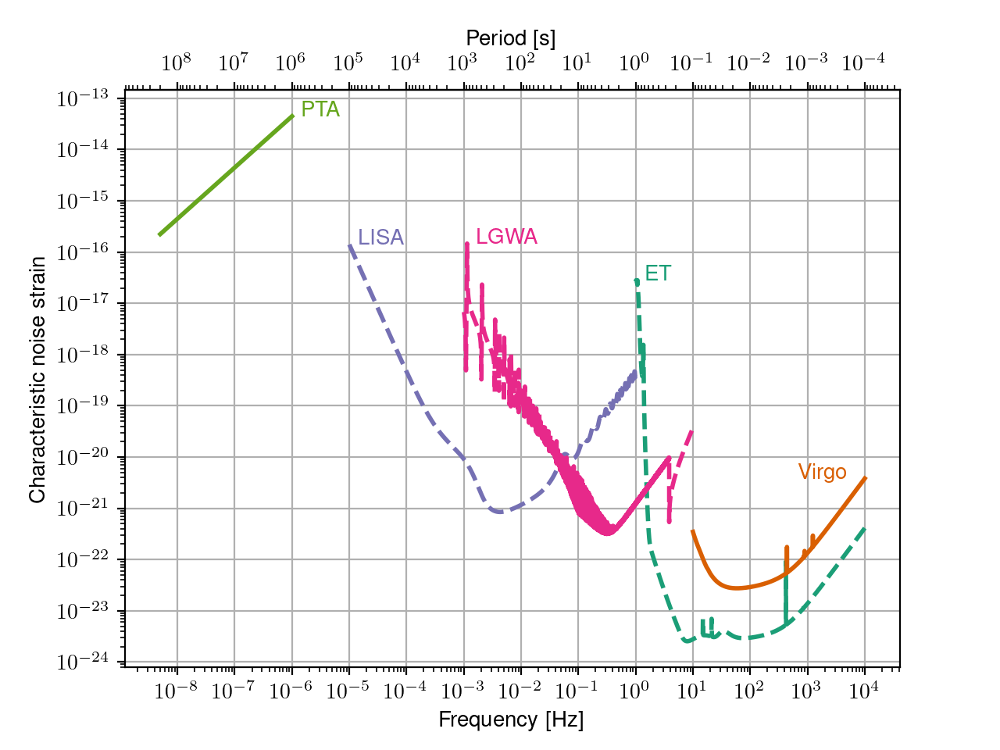

# gw-landscape
A plot of the gravitational wave landscape, inspired by [gwplotter](http://gwplotter.com/)



To make it, install the project with [`poetry`](https://python-poetry.org/docs/#installation)
and create a virtual environment:

```
poetry install
poetry shell
```

Then, run 

```
python -m python -m gw_landscape.gw_landscape_plot
```